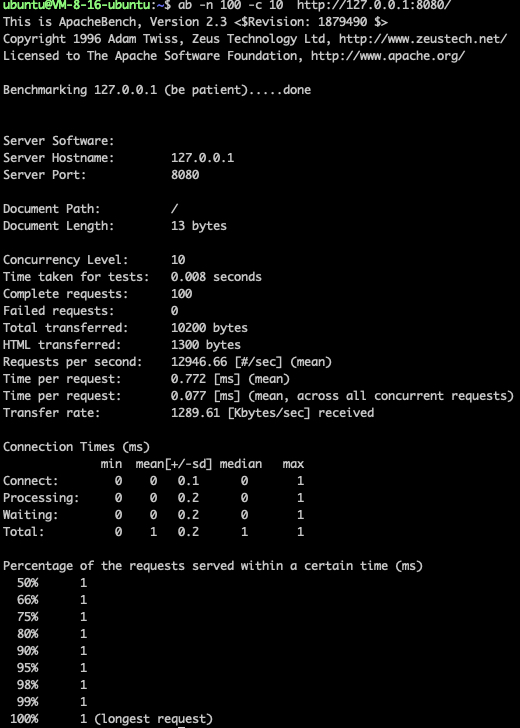

# Coroutine Library (Simplified Sylar Adaptation)

## 📖 Project Overview

This project is a simplified adaptation of the **Sylar server framework**, focusing on the coroutine library. By introducing core modules such as **coroutines**, **scheduler**, and **timer**, and leveraging **HOOK technology**, it transforms traditional synchronous Linux system functions (e.g., `sleep`, `read`, `write`) into asynchronous versions.  
This modification preserves the synchronous I/O programming style while providing the efficiency and responsiveness of asynchronous execution.

---

## 🛠 Runtime Environment
- **Ubuntu 22.04 LTS**

---

## ⚙️ Build Instructions

Navigate to the project directory:
```shell
cd coroutine-lib && cd fiber_lib && cd 6hook
```

Compile and link the executable in the `6hook` directory:
```shell
g++ *.cpp -std=c++17 -o main -ldl -lpthread
```

Run the executable:
```shell
./main
```

Example:  


---

## 🔧 Test Tool Setup

Install Apache Benchmark on Ubuntu:
```shell
sudo apt update
sudo apt install apache2-utils
```

Verify installation:
```shell
ab -V
```

### Run Project with the Test Tool

⚠️ **Remember to start the `main` executable first, and open another terminal window to run the following command:**

```shell
ab -n 100 -c 10 http://127.0.0.1:8080/
```

Example:  


- `-n`: total number of requests  
- `-c`: number of concurrent requests  

👉 Adjust these values based on the number of CPU cores on your server.

---

## 📂 Main Modules

### Coroutine
- Implements asymmetric, independent-stack coroutines.  
- Supports efficient switching between scheduler coroutines and task coroutines.  

### Scheduler
- Maintains tasks using a thread pool and task queue.  
- Worker threads run coroutine tasks in FIFO order and push ready file descriptor events (from epoll) and timed-out tasks into the queue.  

### Timer
- Uses a min-heap algorithm to manage timers, improving timeout callback retrieval efficiency.  

---

## 🔑 Key Technologies
- Thread synchronization and mutexes  
- Thread pool management  
- Epoll-based event-driven model  
- Linux network programming  
- Generic programming  
- Synchronous & asynchronous I/O  
- HOOK technology  

---

## 🚀 Planned Optimizations & Extensions

### Memory Pool Optimization
Currently, each coroutine allocates and frees its own stack, causing frequent system calls. A memory pool can reduce system calls and improve memory efficiency.  

### Nested Coroutine Support
At present, only main–child coroutine switching is supported. By referencing `libco`, more complex nested coroutine hierarchies could be implemented.  

### Advanced Scheduling Algorithms
Introduce OS-like process scheduling strategies (priority, response ratio, time slicing) to support more complex use cases.  

---

## 🧩 Core Concepts

### Synchronous I/O
The application blocks until an I/O operation completes, preventing other tasks from running during the wait.  

### Asynchronous I/O
The application continues execution while I/O is in progress. Completion is notified via callbacks or events.  

### HOOK Technology
Wraps system-level functions to enhance functionality while preserving compatibility with the original API, enabling new features without changing existing call patterns.  

---

## 📊 Performance Testing

After building a coroutine library, it is essential to validate its effectiveness through benchmarking:  

- **Have you tested your coroutine library?**  
- **What advantages does it provide compared to other libraries?**  

These are common interview questions. Detailed performance evaluation not only highlights strengths and bottlenecks but also becomes a showcase of your problem-solving and analytical ability.  

